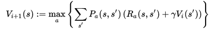
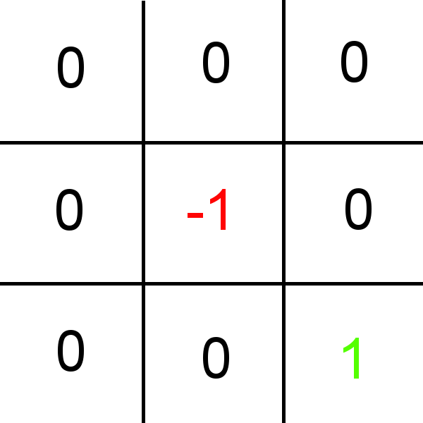

# ValueIteration
ValueIteration implementation in C++

A simple streight forward implementation of value iteration using the following formula:

The states of the example (included in the main file) are the tiles of the following grid:

Possible actions are going top, down, left and right. It is not possible to hit an outer wall.

